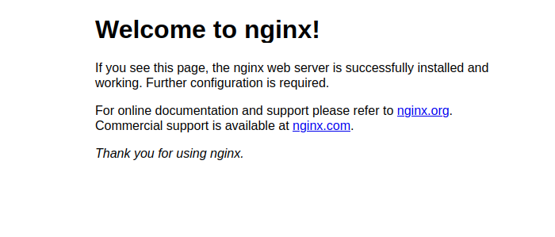

## Root CA
****

- Configuración de `root-ca.conf`:

~~~bash
[default]
name                    = root-ca
domain_suffix           = alexcorp.com
aia_url                 = http://$name.$domain_suffix/$name.crt
crl_url                 = http://$name.$domain_suffix/$name.crl
ocsp_url                = http://ocsp.$name.$domain_suffix:9080
default_ca              = ca_default
name_opt                = utf8,esc_ctrl,multiline,lname,align

[ca_dn]
countryName             = "MX"
organizationName        = "ALEXCORP"
commonName              = "Root CA"

[ca_default]
home                    = .
database                = $home/db/index
serial                  = $home/db/serial
crlnumber               = $home/db/crlnumber
certificate             = $home/$name.crt
private_key             = $home/private/$name.key
RANDFILE                = $home/private/random
new_certs_dir           = $home/certs
unique_subject          = no
copy_extensions         = none
default_days            = 3650
default_crl_days        = 365
default_md              = sha256
policy                  = policy_c_o_match

[policy_c_o_match]
countryName             = match
stateOrProvinceName     = optional
organizationName        = match
organizationalUnitName  = optional
commonName              = supplied
emailAddress            = optional

[req]
default_bits            = 4096
encrypt_key             = no
default_md              = sha256
utf8                    = yes
string_mask             = utf8only
prompt                  = no
distinguished_name      = ca_dn
req_extensions          = ca_ext

[ca_ext]
basicConstraints        = critical,CA:true
keyUsage                = critical,keyCertSign,cRLSign
subjectKeyIdentifier    = hash

[sub_ca_ext]
authorityInfoAccess     = @issuer_info
authorityKeyIdentifier  = keyid:always
basicConstraints        = critical,CA:true,pathlen:0
crlDistributionPoints   = @crl_info
extendedKeyUsage        = clientAuth,serverAuth
keyUsage                = critical,keyCertSign,cRLSign
nameConstraints         = @name_constraints
subjectKeyIdentifier    = hash

[crl_info]
URI.0                   = $crl_url

[issuer_info]
caIssuers;URI.0         = $aia_url
OCSP;URI.0              = $ocsp_url

[name_constraints]
permitted;DNS.0=alexcorp.com
excluded;IP.0=0.0.0.0/0.0.0.0
excluded;IP.1=0:0:0:0:0:0:0:0/0:0:0:0:0:0:0:0

[ocsp_ext]
authorityKeyIdentifier  = keyid:always
basicConstraints        = critical,CA:false
extendedKeyUsage        = OCSPSigning
keyUsage                = critical,digitalSignature
subjectKeyIdentifier    = hash
~~~

- Crear directorio para `root-ca`:

~~~bash
mkdir root-ca
cd root-ca
mkdir certs db private
chmod 700 private
touch db/index
openssl rand -hex 16 > db/serial
echo 1001 > db/crlnumber
~~~

### Generación de Root CA

Para obtener el archivo `root-ca.csr` y `root-ca.key` hacemos lo siguiente:

~~~bash
openssl req -new \
	-config root-ca.conf \
	-out root-ca.csr \
	-keyout private/root-ca.key
~~~

Autofirmar el certificado:

~~~bash
openssl ca -selfsign \
	-config root-ca.conf \
	-in root-ca.csr \
	-out root-ca.crt \
	-extensions ca_ext
~~~

******

### Sub CA

*****

- Crear directorios para Sub Ca:

~~~bash
mkdir sub-ca
cd sub-ca
mkdir certs db private
chmod 700 private
touch db/index
openssl rand -hex 16 > db/serial
echo 1001 > db/crlnumber
~~~

- Crear archivo de configuración `sub-ca.conf`:

~~~bash
[default]
name                    = sub-ca
domain_suffix           = alexcorp.com
aia_url                 = http://$name.$domain_suffix/$name.crt
crl_url                 = http://$name.$domain_suffix/$name.crl
ocsp_url                = http://ocsp.$name.$domain_suffix:9081
default_ca              = ca_default
name_opt                = utf8,esc_ctrl,multiline,lname,align

[ca_dn]
countryName             = "MX"
organizationName        = "ALEXCORP"
commonName              = "Sub CA"

[ca_default]
home                    = .
database                = $home/db/index
serial                  = $home/db/serial
crlnumber               = $home/db/crlnumber
certificate             = $home/$name.crt
private_key             = $home/private/$name.key
RANDFILE                = $home/private/random
new_certs_dir           = $home/certs
unique_subject          = no
copy_extensions         = copy
default_days            = 365
default_crl_days        = 30
default_md              = sha256
policy                  = policy_c_o_match

[policy_c_o_match]
countryName             = match
stateOrProvinceName     = optional
organizationName        = match
organizationalUnitName  = optional
commonName              = supplied
emailAddress            = optional

[req]
default_bits            = 2048
encrypt_key             = no
default_md              = sha256
utf8                    = yes
string_mask             = utf8only
prompt                  = no
distinguished_name      = ca_dn

[server_ext]
authorityInfoAccess     = @issuer_info
authorityKeyIdentifier  = keyid:always
basicConstraints        = critical,CA:false
crlDistributionPoints   = @crl_info
extendedKeyUsage        = clientAuth,serverAuth
keyUsage                = critical,digitalSignature,keyEncipherment
subjectKeyIdentifier    = hash

[client_ext]
authorityInfoAccess     = @issuer_info
authorityKeyIdentifier  = keyid:always
basicConstraints        = critical,CA:false
crlDistributionPoints   = @crl_info
extendedKeyUsage        = clientAuth
keyUsage                = critical,digitalSignature
subjectKeyIdentifier    = hash

[crl_info]
URI.0                   = $crl_url

[issuer_info]
caIssuers;URI.0         = $aia_url
OCSP;URI.0              = $ocsp_url

[ocsp_ext]
authorityKeyIdentifier  = keyid:always
basicConstraints        = critical,CA:false
extendedKeyUsage        = OCSPSigning
keyUsage                = critical,digitalSignature
subjectKeyIdentifier    = hash
~~~

- Generar `sub-ca.csr` y `sub-ca.key`

~~~bash
openssl req -new \
	-config sub-ca.conf \
	-out sub-ca.csr \
	-keyout private/sub-ca.key
~~~

- Certificado firmado por `root-ca`:

~~~bash
openssl ca \
	-config root-ca.conf \
	-in sub-ca.csr
	-out sub-ca.crt
	-extensions sub_ca_ext
~~~

*****

### Server Certificate

****

- Creamos el siguiente directorio para el archivo `server.conf` 

~~~bash
mkdir server
cd server
mkdir certs private
chmod 700 private
~~~

- crear RSA key (`server.key`)

~~~bash
openssl genrsa -out private/server.key 2048
~~~

- `server.conf`

~~~bash
[req]
prompt = no
distinguished_name = dn
req_extensions = ext

[dn]
CN = alexcorp.com
emailAddress = al3zzz@alexcorp.com
O = ALEXCORP
L = GDL
C = MX

[ext]
subjectAltName = DNS:alexcorp.com
~~~

- Creamos el `server.csr`

~~~bash
openssl req -new \
	-config server.conf \
	-key server.key \
	-out server.csr
~~~

- Firmamos con la `sub-ca` el `server.crt`

~~~bash
openssl ca \
	-config sub-ca.conf \
	-in server.csr \
	-out server.crt \
	-extensions server_ext
~~~

finalmente tenemos nuestros 3 certificados, `root-ca.crt`, `sub-ca.crt`, `server.crt`.

*****

### Ubuntu Nginx

*****

- Descargar Nginx para Ubuntu

~~~bash
sudo apt install nginx -y
~~~

Verifica si el servicio se esta ejecutando:

- Si no conoces la ip de tu servidor puedes usar `icanhazip.com`

~~~python
$ curl -4 icanhazip.com
~~~

Después de obtenerla, ingresa en el navegador:

~~~
http://server_ip
~~~

- Crear un directorio para `tudominio`.

~~~bash
sudo mkdir -p /var/www/*alexcorp.com*/html
~~~

- Cambiar el usuario y grupo

~~~bash
sudo chown -R ubuntu:ubuntu /var/www/*alexcorp.com*/html
~~~

También cambiar los permisos a los grupos y terceros.

~~~bash
sudo chmod -R 755 /var/www/*alexcorp.com*
~~~

- Crear archivo `index.html`

~~~bash
nano /var/www/*alexcorp.com*/html/index.html
~~~

Dentro del archivo agregamos código HTML.

~~~html
<html>
    <head>
        <title>Welcome to your_domain!</title>
    </head>
    <body>
        <h1>Success!  The your_domain server block is working!</h1>
    </body>
</html>
~~~

- Modificar el archivo creando uno nuevo en `/etc/nginx/sites-available/*tu_dominio`

~~~bash
sudo nano /etc/nginx/sites-available/*alexcorp.com*
~~~

~~~bash
server {
        listen 80;
        listen [::]:80;

        root /var/www/*alexcorp.com*/html;
        index index.html index.htm index.nginx-debian.html;

        server_name *alexcorp.com* *www.alexcorp.com*;

        location / {
                try_files $uri $uri/ =404;
        }
}
~~~

Ahora habilitamos un enlace entre este y el directorio `sites-enabled` 

~~~bash
sudo ln -s /etc/nginx/sites-available/tu_dominio /etc/nginx/sites-enabled/
~~~

Checamos errores de sintaxis:

~~~bash
sudo nginx -t 
~~~

Reiniciamos

~~~bash
sudo systemctl restart nginx
~~~

****

### HTTPS

******

- Crea el directorio `ssl` en `/etc/nginx/ssl`

~~~bash
mkdir /etc/nginx/ssl
~~~

Aquí agregaremos `fullchain.pem` que será la concatenación de `server.crt` `sub-ca.crt` y `root-ca.crt`. Y aquí mismo en `ssl` guardaremos RSA KEY `server.key`

- Recomendación, a tu directorio ssl cambia los permisos.

~~~bash
chmod 700 ssl 
~~~

- En `/etc/nginx/sites-available/tu_dominio` agregamos esto para ssl.

~~~bash
server {
    listen              443 ssl;
    server_name         *alexcorp.com*;
    ssl_certificate     /etc/nginx/ssl/fullchain.pem;
    ssl_certificate_key /etc/nginx/ssl/server.key;
    ssl_protocols       TLSv1 TLSv1.1 TLSv1.2 TLSv1.3;
    ssl_ciphers         HIGH:!aNULL:!MD5;
    
    root /var/www/*alexcorp.com*/html;
    index index.html index.htm index.nginx-debian.html;

    location / {
            try_files $uri $uri/ =404;
    }
}
~~~

Ahora, solo reinicia el servicio.

~~~bash
sudo systemctl restart nginx
~~~

Monta en tu navegador el `root-ca.crt` y listo.

